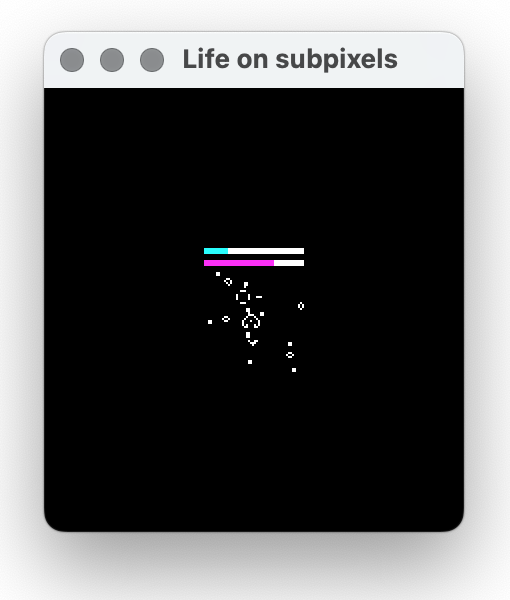

# The Lifegame on Subpixels

This is an implementation of Conway's Game of Life in Rust 🦀.

The game can be run on both regular pixels and subpixels.

## Default Settings

- **Grid Width:** 100 cells
- **Grid Height:** 100 cells
- **Life Density:** 0.08 (8% of the cells are alive initially)
- **Speed:** 3 (medium speed)
- **Subpixels:** Enabled

## Controls

- **`r`**: Randomize the grid with the current life density.
- **`Enter`**: Start/stop the simulation.
- **`Space`**: Step through the simulation one frame at a time (when paused).
- **`↑ (Arrow Up)`**: Increase life density up to a maximum of 0.5 (restarts the simulation if it is running).
- **`↓ (Arrow Down)`**: Decrease life density down to a minimum of 0.01 (restarts the simulation if it is running).
- **`→ (Arrow Right)`**: Increase simulation speed.
- **`← (Arrow Left)`**: Decrease simulation speed.
- **`Escape`**: Close the application.


## Running the Game

To run this game, use the following command:

```bash
cargo run
```


## Game of Life on Pixels

To start the game in regular pixels mode, set the `SUBPIXELS` constant to `false` in the source code:

```rust
const SUBPIXELS: bool = false;
```




## Game of Life on Subpixels

To start the game in subpixels mode, set the `SUBPIXELS` constant to `true` in the source code:

```rust
const SUBPIXELS: bool = true;
```


### Important Note for Subpixels Mode

This mode is clearly visible only in the display resolution mode when the pixel's density is 1x. In modes like 2x or more, each image pixel consists of 2x2 or more pixels, so this game's principle will be completely broken.

To check the screen resolution on macOS:

1. Go to **System Settings**.
2. Select **Displays**.
3. Check if the current resolution is set to the real display resolution and change it if needed.

In my case I switch to **3840x2160** mode to watch the subpixel mode game.


## Dependencies

This project uses the following crates:

- [winit](https://github.com/rust-windowing/winit): For window creation and event handling.
- [pixels](https://github.com/parasyte/pixels): For rendering graphics.